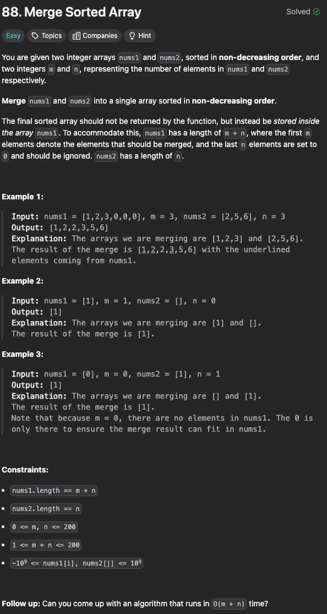
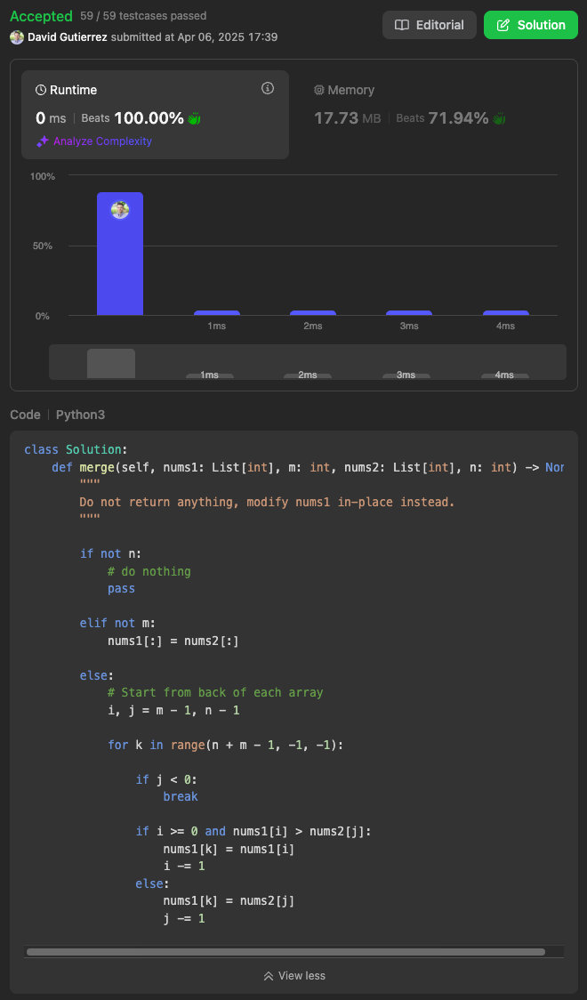

Notes: 

- Whenever  trying to solve an array problem in place, always consider the possibility of iterating backwards instead of forwards through the array. It can completely change the problem, and make it a lot easier.

Mnemonic:

“👣 Go backwards to stay safe!”

Here’s the idea:
	•	You’re filling nums1 from the back to avoid overwriting the numbers already in nums1.
	•	Use 3 pointers:
	•	i at the end of valid nums1
	•	j at the end of nums2
	•	k at the end of total nums1 space
	•	Compare nums1[i] and nums2[j] — whoever is bigger, put them at nums1[k]
	•	Decrement the appropriate pointer and repeat.
